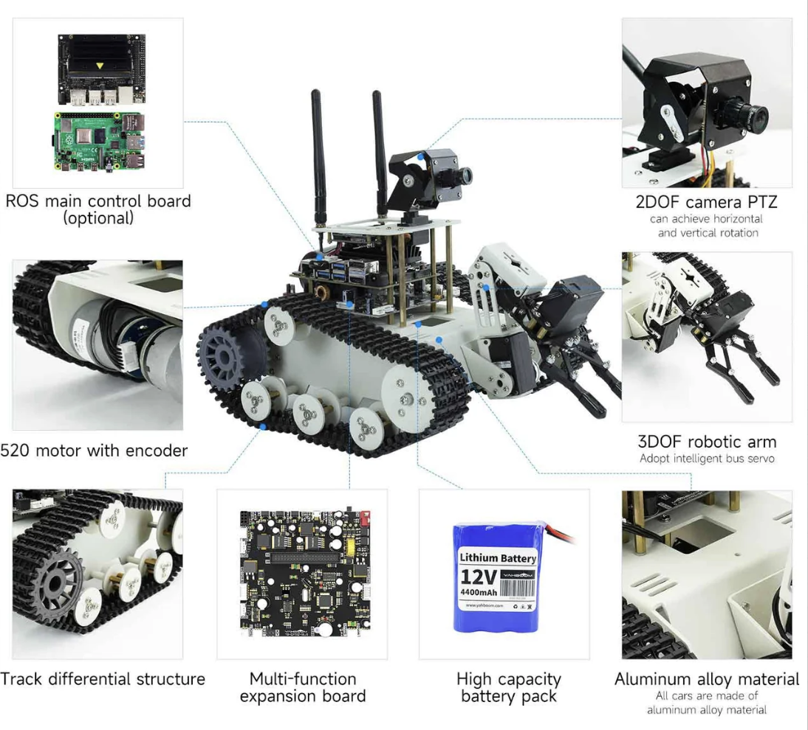
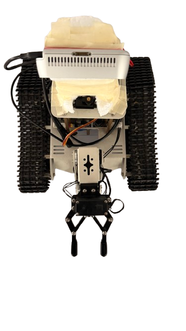
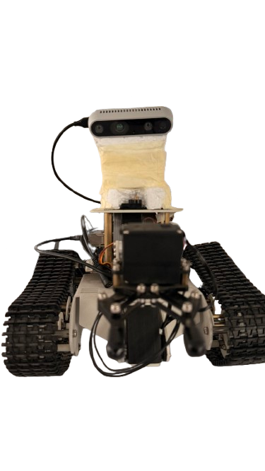
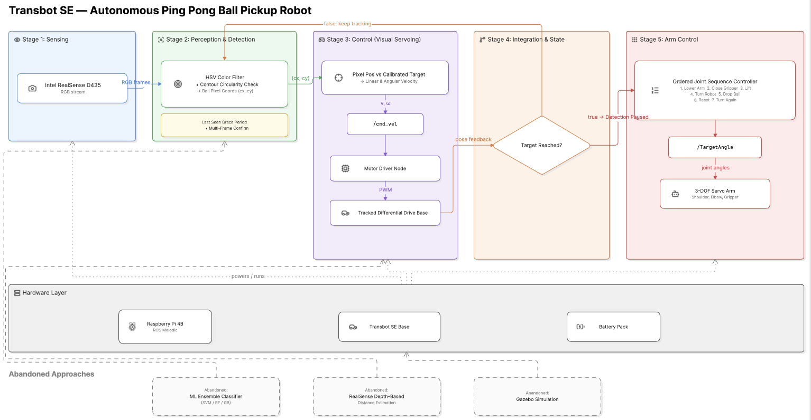

# Autonomous Object Detection and Retrieval Using an Ensemble Machine Learning Pipeline on the Yahboom Transbot SE

### A Low-Cost Robotic Solution for Nepal’s Emerging Industrial Automation

**Course:** Machine Learning & Intelligent Agents (combined ML + ROS robotics project)  
**Institution:** SOFTWARICA COLLEGE OF IT AND E-COMMERCE 
**Supervisors:** Prof. Shrawan Thakur · Mr. Albert Maharjan  

---

## Abstract

This project implements an **autonomous intelligent agent** on the Yahboom Transbot SE that detects an orange ping pong ball, navigates toward it using **visual servoing**, stops at a calibrated image coordinate, and executes a **pick–turn–drop–reset** arm sequence. Perception combines **classical computer vision** (HSV, contour shape, Hough circle confirmation) with a researched **ensemble machine learning pipeline** (HOG features + SVM + Random Forest + Gradient Boosting). Actuation is fully integrated through **ROS 1 Melodic** topics (`/cmd_vel`, `/TargetAngle`).

The system targets **low-cost industrial automation** in resource-constrained environments such as Nepal, where Raspberry Pi–class compute and open-source ROS stacks can substitute for expensive commercial robotics platforms.

---

## Table of Contents

1. [Project Goal](#1-project-goal)
2. [Team & Contributions](#2-team--contributions)
3. [Hardware Platform](#3-hardware-platform)
4. [Our Physical Build (Photos)](#4-our-physical-build-photos)
5. [Software Environment](#5-software-environment)
6. [System Architecture](#6-system-architecture)
7. [Intelligent Agent Design](#7-intelligent-agent-design)
8. [Machine Learning Pipeline](#8-machine-learning-pipeline)
9. [Computer Vision Detection](#9-computer-vision-detection)
10. [Depth Sensing Investigation](#10-depth-sensing-investigation)
11. [Navigation & Visual Servoing](#11-navigation--visual-servoing)
12. [Arm Pickup Sequence](#12-arm-pickup-sequence)
13. [ROS Topics & Integration](#13-ros-topics--integration)
14. [Simulation Attempt](#14-simulation-attempt)
15. [Repository Structure](#15-repository-structure)
16. [How to Run](#16-how-to-run)
17. [Calibration](#17-calibration)
18. [Results & Known Limitations](#18-results--known-limitations)
19. [Future Work](#19-future-work)
20. [Acknowledgments](#20-acknowledgments)

---

## 1. Project Goal

| # | Task | Method |
|---|------|--------|
| 1 | **Detect** orange ping pong ball | RealSense RGB + CV pipeline (+ ML ensemble researched) |
| 2 | **Approach** ball while keeping it centered | Visual servoing → `/cmd_vel` |
| 3 | **Stop** at grasp pose | Pixel target `(TARGET_X, TARGET_Y)` — not depth |
| 4 | **Pick up** with arm | Ordered joint sequence → `/TargetAngle` |
| 5 | **Relocate** ball | Turn 180° → drop → reset arm → turn back |

**End state:** Working physical demo on Transbot SE under ROS Melodic (simulation explored but not used for final delivery).

---

## 2. Team & Contributions

| Member | Role | Documentation focus |
|--------|------|---------------------|
| **Pawan Acharya** | ROS software environment, integration, control logic | Bringup, pyenv/venv, ROS node wiring, detect ↔ drive ↔ arm state machine |
| **Pratik Joshi** | Arm movement & navigation | `/cmd_vel` visual servoing, joint sequences, turn–drop–reset |
| **Dikshanta Chapagain** | Machine learning + object detection | HOG ensemble training, HSV/Hough production detector, `detect.py` / `coor.py` |
| **Ishneha Hirachan** | Depth sensor (Intel RealSense D435) | librealsense ARM build, depth sampling, why depth was dropped for stopping |
| **Simon Rai** | Simulation | Gazebo 9 + MoveIt demo, URDF limits, decision to stay on hardware |
| **Nishan BK** | Hardware setup | Mechanical mount, cabling, joint ranges, camera servo default, power |

---

## 3. Hardware Platform

### 3.1 Platform overview (Yahboom Transbot SE)

The diagram below is the **official Yahboom annotated hardware reference** for the Transbot SE. Each callout maps to a subsystem used in this project.



**Figure 1 — Transbot SE component map** *(source: Yahboom product documentation)*

| # | Component | Specification | Project use |
|---|-----------|---------------|-------------|
| 1 | **ROS main control board** | Raspberry Pi 4B (optional Jetson Nano on other configs) | **Our compute** — runs Ubuntu 18.04, ROS Melodic, detection node |
| 2 | **2-DOF camera PTZ** | Pan + tilt rotation | Camera mount; default PWM servo angle set to **120°** |
| 3 | **3-DOF robotic arm** | Intelligent bus servos | Joints **7** (shoulder), **8** (elbow), **9** (gripper) — ball pickup |
| 4 | **Chassis material** | Aluminum alloy | Lightweight rigid frame for tracks + arm loads |
| 5 | **Battery pack** | Lithium **12 V, 4400 mAh** | Powers Pi, motors, servos, RealSense |
| 6 | **Multi-function expansion board** | Yahboom I/O board | Bridges Pi ↔ motors, servos, sensors |
| 7 | **Track differential drive** | Left/right continuous tracks | Base motion via `/cmd_vel` |
| 8 | **520 motor + encoder** | Encoded drive motors | Wheel odometry on `/odom` (available; stop logic uses vision) |

### 3.2 Arm joint limits

| Joint ID | Name | Valid angle range |
|----------|------|-------------------|
| **7** | Shoulder | 0° – 225° |
| **8** | Elbow | 200° – 270° |
| **9** | Gripper | 30° – 180° |

### 3.3 Vision sensor

| Item | Detail |
|------|--------|
| Sensor | **Intel RealSense D435** |
| Connection | USB 3.0 |
| **Production use** | **Color stream only** (640×480 @ 30 FPS) via `pyrealsense2` |
| **Explored** | Aligned depth stream — abandoned for stop logic (see §10) |

### 3.4 Compute & development

| Machine | Role |
|---------|------|
| **Raspberry Pi 4B** (on robot) | Runtime: ROS, drivers, detection, arm control |
| **MacBook** (Apple Silicon) | ML training attempts; old numpy/scipy wheels failed to build |
| **RealVNC** | Remote desktop into Pi |
| **ssh / scp** | File transfer Pi ↔ Mac |

---

## 4. Our Physical Build (Photos)

These are **photographs of our actual project robot** — custom RealSense mounting and arm wiring as built for the ping pong demo.

### 4.1 Top-down view



**Figure 2 — Project robot (top view)**

| Visible element | Description |
|-----------------|-------------|
| **Tracked base** | Dual continuous rubber tracks (tank-style differential drive) |
| **RealSense D435** | Silver housing mounted on elevated platform (masking-tape custom mount) |
| **3-DOF arm** | Metal linkage + black gripper extending forward from chassis |
| **Internal wiring** | Servo ribbon cables (orange/red/brown) to expansion board |
| **USB cable** | RealSense USB 3.0 connection to Pi |

### 4.2 Front view



**Figure 3 — Project robot (front view)**

| Visible element | Description |
|-----------------|-------------|
| **Gripper (Joint 9)** | Two-finger end effector, positioned for floor-level pickup |
| **Arm linkage** | Shoulder + elbow servos with visible power/signal wiring |
| **Elevated RealSense** | Camera raised above arm for downward field of view toward table/floor |
| **Track treads** | Black lugged tracks for forward/reverse + in-place rotation |

### 4.3 Build vs. stock platform

| Aspect | Stock Transbot SE (Fig. 1) | Our build (Fig. 2–3) |
|--------|---------------------------|----------------------|
| Camera | 2-DOF PTZ mount | **Intel RealSense D435** on custom elevated bracket |
| Arm | 3-DOF bus servos | Same — tuned joint angles for ping pong grasp |
| Compute | Pi 4B on expansion board | Same + isolated Python 3.9 for detection |

---

## 5. Software Environment

| Layer | Version / note |
|-------|----------------|
| OS | Ubuntu **18.04** (64-bit) |
| Middleware | **ROS 1 Melodic** |
| System Python | **3.6.9** — required by Melodic + `Transbot_Lib`; **never replaced** |
| Detection Python | **3.9.18** via **pyenv**, local to `pingpong_detector/` |
| RealSense SDK | **librealsense v2.50.0** compiled from source on ARM64 |
| Vision | OpenCV 4.x, NumPy (matched versions in `detect_env` venv) |

### 5.1 Why two Python versions?

ROS Melodic and Yahboom's `Transbot_Lib` (Python 3.6 egg) must remain on system Python. Trained ML models and modern NumPy/OpenCV require Python ≥ 3.9. **pyenv** installs 3.9.18 alongside 3.6 without breaking ROS.

### 5.2 RealSense build (ARM64)

Prebuilt `pyrealsense2` pip wheels do not exist for Raspberry Pi ARM. We compiled librealsense **v2.50.0** (last version supporting Python 3.6/3.9) with:

```bash
cmake .. -DBUILD_PYTHON_BINDINGS=bool:true \
         -DPYTHON_EXECUTABLE=/usr/bin/python3.9 \
         -DFORCE_RSUSB_BACKEND=true
make -j2 && sudo make install
export PYTHONPATH=$PYTHONPATH:/usr/local/lib/python3.9/pyrealsense2
```

Build time on Pi 4B: ~45–90 minutes.

### 5.3 Transbot library paths

| Path | Purpose |
|------|---------|
| `/usr/local/lib/python3.6/dist-packages/Transbot_Lib-…` | Runtime library |
| `~/py_install-V3.2.5/py_install/Transbot_Lib/` | Editable source |
| `transbot_driver.py` | Camera servo default: `set_pwm_servo(2, 120)` |
| `Transbot_Lib.py` | Joint 8 elbow angle formula fix |

### 5.4 ROS bringup

```bash
roslaunch transbot_bringup bringup.launch
```

---

## 6. System Architecture

The diagram below is the **project system architecture** — how sensing, perception, control, state logic, and arm actuation connect through ROS.



**Figure 4 — System architecture diagram**

---

### 6.1 Stage 1 — Sensing

| Input | Output |
|-------|--------|
| Intel RealSense D435 | RGB frames (640×480 BGR) |

- Color stream opened via `pyrealsense2` pipeline
- Depth stream **not used** in final stop logic
- Fallback: USB webcam if RealSense unavailable

---

### 6.2 Stage 2 — Perception & detection

| Step | Algorithm |
|------|-----------|
| Color filter | HSV threshold (orange ball vs. skin/background) |
| Shape filter | Contour area + circularity |
| Confirmation | Grayscale **HoughCircles** (rejects skin-colored blobs) |
| Optional (research) | HOG + **SVM / RF / GB ensemble** (`detect.py`) |
| Reliability | **Last-seen grace period** (~0.5–0.8 s) |
| Arm trigger guard | **Multi-frame confirm** (N consecutive "reached" frames) |

**Output:** Ball pixel coordinates **`(cx, cy)`**

---

### 6.3 Stage 3 — Control (visual servoing)

| Input | Logic | Output |
|-------|-------|--------|
| `(cx, cy)` vs. `(TARGET_X, TARGET_Y)` | Proportional pixel-error controller | `geometry_msgs/Twist` |

```
/cmd_vel  →  Motor driver node  →  PWM  →  Tracked differential drive
```

| Error | Action |
|-------|--------|
| `cx ≠ TARGET_X` | Turn left/right (`angular.z`) |
| `cy < TARGET_Y` (ball too high in frame) | Drive forward (`linear.x`) |
| Both within tolerance | Stop base |

---

### 6.4 Stage 4 — Integration & state

```
                    ┌─────────────────┐
                    │ Target reached? │
                    └────────┬────────┘
              false          │          true
                │            │            │
                ▼            │            ▼
         Keep tracking       │     Detection PAUSED
         (Stages 1–3)        │     arm_active = true
                             │            │
                             │            ▼
                             │     Stage 5 (Arm)
```

**Key rule:** Detection and arm control are **mutually exclusive**. Once the arm takes over, `find_ball()` is never called until the script exits.

---

### 6.5 Stage 5 — Arm control

| Step | Action |
|------|--------|
| 1 | Move to default / pre-grasp pose |
| 2 | Lower arm (elbow → shoulder sequence) |
| 3 | Close gripper (Joint 9) |
| 4 | Lift arm |
| 5 | Turn robot ~180° (`/cmd_vel`) |
| 6 | Drop ball (open gripper) |
| 7 | Reset to default pose |
| 8 | Turn ~180° back |

```
/TargetAngle  →  Arm driver  →  Joints 7, 8, 9
```

Message format: `transbot_msgs/Arm` containing `Joint[]` with `{id, angle, run_time}`.

---

### 6.6 Hardware layer (powers all stages)

| Component | Role |
|-----------|------|
| Raspberry Pi 4B | ROS Melodic master + detection node |
| Transbot SE base | Tracks + arm + expansion board |
| 12 V 4400 mAh battery | Power |

---

### 6.7 Approaches explored but not used in final demo

| Approach | Reason abandoned |
|----------|------------------|
| **ML ensemble as runtime gate** | Pickle / NumPy / sklearn version mismatch across Mac ↔ Pi |
| **RealSense depth-based distance** | Sparse IR returns on small glossy ping pong balls |
| **Gazebo simulation** | URDF lacked wheeled-base plugin; Pi too slow for Gazebo GUI |

These remain documented as **critical evaluation** — valid engineering decisions, not failures.

---

## 7. Intelligent Agent Design

This project is framed as a **hybrid intelligent agent** combining reflex control, a simple world model, and task-level sequencing.

### 7.1 Agent properties

| Property | Implementation |
|----------|----------------|
| **Sensors** | RGB camera (RealSense D435 color) |
| **Effectors** | Differential tracks + 3-DOF arm |
| **Percepts** | `seen(ball, cx, cy, t)`, mask quality, reached counter |
| **Actions** | Publish Twist, publish Arm joint lists |
| **Control** | Model-based reflex (pixel-error minimization) |
| **Planning** | Fixed ordered pickup script (task-level plan) |

### 7.2 State machine

```
SEARCH ──detect──► TRACK & SERVO ◄── grace period ──┐
                        │                           │
                        │ N frames at target        │ brief miss
                        ▼                           │
                   CONFIRM REACHED ──────────────────┘
                        │
                        ▼
                   ARM SEQUENCE (detection off)
                        │
                        ▼
                      DONE
```

### 7.3 Knowledge representation (informal)

| Predicate | Meaning |
|-----------|---------|
| `seen(ball, cx, cy, t)` | Ball detected at time t |
| `stale(ball)` | `now − t > LAST_SEEN_TIMEOUT` |
| `centered_x` | `\|cx − TARGET_X\| ≤ TOLERANCE_X` |
| `in_grasp_zone` | `\|cy − TARGET_Y\| ≤ TOLERANCE_Y` |
| `confirmed` | `reached_count ≥ REACHED_CONFIRM_FRAMES` |
| `arm_active` | Detection loop skipped |

**Inference rule:**  
`confirmed ∧ ¬pickup_done → stop(base) ∧ arm_active ∧ execute(pickup_sequence)`

---

## 8. Machine Learning Pipeline

*(Ishneha Hirachan — depth; Dikshant — ML training & CV)*

### 8.1 Problem

Pure color filtering produces false positives (skin tones, orange objects). An **ensemble classifier** was trained to confirm: *"Is this crop a ping pong ball?"*

### 8.2 Dataset

- **Source:** [Roboflow — Ping Pong Detection](https://universe.roboflow.com/pingpong-ojuhj/ping-pong-detection-0guzq1) (YOLO format)
- **Positives:** Labeled ball bounding-box crops
- **Negatives:** Random non-ball regions from same images

### 8.3 Pipeline

| Stage | Detail |
|-------|--------|
| Preprocess | Resize crop to **64×64** |
| Features | **HOG** — win 64, block 16, stride 8, cell 8, 9 bins |
| Classifiers | **SVM**, **Random Forest**, **Gradient Boosting** |
| Fusion | Average probability + vote count (≥ 2/3 models agree) |
| Output | `models/ensemble_models.pkl`, `models/ensemble_scaler.pkl` |

### 8.4 Training layout

```
pingpong_detector/
├── train.py
├── detect.py
├── dataset/
│   ├── train/{images, labels}
│   └── valid/{images, labels}
└── models/
    ├── ensemble_models.pkl
    └── ensemble_scaler.pkl
```

### 8.5 Cross-platform deployment challenges

| Error | Root cause | Fix attempted |
|-------|------------|---------------|
| `No module named 'numpy._core'` | Mac NumPy 2.x pickle on Pi NumPy 1.x | pyenv 3.9 + version match |
| sklearn 1.6 install fail on Pi | Python 3.6 ceiling (max sklearn 0.24.2) | Separate Python 3.9 env |
| Apple Silicon `faltivec` build fail | No ARM wheels for numpy 1.19.5 | Windows retrain / drop ML |
| OpenCV 5 HOG missing | API + NumPy ABI mismatch | Pin opencv-python 4.10 |

### 8.6 Production decision

**Runtime:** Pure CV in `coor.py` / `coor2.py` (HSV + circularity + Hough).  
**Research:** Full ensemble pipeline preserved in `detect.py` for ML documentation and comparison.

---

## 9. Computer Vision Detection

*(Final demo path — Dikshant / Pawan)*

### 9.1 HSV tuning (color-picked values)

| Source | Hex | Notes |
|--------|-----|-------|
| Ping pong ball | `#dd7818` | High saturation (~227) |
| Skin tone 1 | `#815636` | Lower saturation (~148) |
| Skin tone 2 | `#603e31` | Hue ~8, saturation ~125 |

**Tuned range:** `LOWER_ORANGE = [10, 170, 100]`, `UPPER_ORANGE = [22, 255, 255]`  
Raising the **saturation floor to 170** rejects skin while keeping the ball.

### 9.2 Detection steps

1. BGR → HSV → `inRange` mask  
2. Morphology open/close (5×5 ellipse, 1 iteration)  
3. Contours: `area ≥ 30`, `circularity ≥ 0.55`  
4. Top candidates → **HoughCircles** confirmation on grayscale crop  
5. Return best `(cx, cy, radius)`

### 9.3 Reliability mechanisms

| Feature | Config | Purpose |
|---------|--------|---------|
| Last-seen grace | `LAST_SEEN_TIMEOUT = 0.8 s` | Continue on last `(cx, cy)` through brief misses |
| Reached debounce | `REACHED_CONFIRM_FRAMES = 60` | Prevent single-frame false arm trigger |
| Mutual exclusion | `arm_active` flag | No detection during arm sequence |

---

## 10. Depth Sensing Investigation

*(Ishneha Hirachan)*

### 10.1 Setup

- librealsense **v2.50.0** compiled from source on ARM64 (no pip wheels)
- Enabled depth + color streams; aligned depth to color
- Sampled median depth in window around `(cx, cy)`

### 10.2 Processing attempted

| Technique | Purpose |
|-----------|---------|
| Wider sampling window | More valid depth pixels |
| Outlier rejection (±5 cm from median) | Remove background contamination |
| Hole-filling filter | Patch missing depth pixels |
| Temporal smooth + 1 s hold | Reduce N/A flicker |

### 10.3 Why depth was dropped

Ping pong balls are **small, glossy, and spherical** → sparse/noisy IR returns. Observed behavior: distance flickered (`N/A` ↔ 0.4 m ↔ 0.5 m at the same physical position), causing jerky stop/go on `/cmd_vel`.

### 10.4 Replacement

**Pixel-row visual servoing:** stop when ball center reaches calibrated `TARGET_Y` in the image (camera looks downward at table/floor).

---

## 11. Navigation & Visual Servoing

*(Pratik / Pawan)*

Camera mounted with slight downward tilt:

| Ball position in frame | Physical meaning |
|------------------------|------------------|
| Small **y** (upper frame) | Ball is **far** |
| Large **y** (lower frame) | Ball is **close** |

### Control law (`coor.py`)

```python
x_error = cx - TARGET_X          # turn to center horizontally
y_error = TARGET_Y - cy          # drive forward while ball is "too high"

if |x_error| > TOLERANCE_X:  angular.z = -0.004 * x_error
if |y_error| > TOLERANCE_Y:  linear.x  = 0.005 * y_error
else:                         linear.x  = 0  → STOP
```

| Parameter | Typical value |
|-----------|---------------|
| `TARGET_X` | Frame center + offset (~380) |
| `TARGET_Y` | ~380 (calibrate per mount) |
| `TOLERANCE_X/Y` | 15 px |
| `MAX_LINEAR` | 0.15 m/s |
| `MAX_ANGULAR` | 0.4 rad/s |

---

## 12. Arm Pickup Sequence

*(Pratik)*

### 12.1 ROS message structure

```yaml
# transbot_msgs/Arm
Joint[] joint
  int32 id        # 7=shoulder, 8=elbow, 9=gripper
  int32 run_time  # milliseconds
  float32 angle   # degrees
```

### 12.2 Calibrated sequence (our robot)

| Phase | Command |
|-------|---------|
| **Default pose** | J9:30 · J8:200 · J7:60 |
| **Pickup** | J8:250 → J7:0 → J9:120 → J7:50 |
| **Turn** | `/cmd_vel` angular ~180° (timed) |
| **Drop pose** | J8:200 · J9:30 |
| **Reset** | Return to default |
| **Turn back** | `/cmd_vel` angular ~180° |

**Send multiple joints in one message** — publishing joints separately with `queue_size=1` caused only the last command (gripper) to execute.

### 12.3 Manual testing

```bash
# Gripper only
rostopic pub /TargetAngle transbot_msgs/Arm \
  "{joint: [{id: 9, angle: 90, run_time: 1000}]}" -1

# Shoulder + elbow together
rostopic pub /TargetAngle transbot_msgs/Arm \
  "{joint: [{id: 7, angle: 60, run_time: 1000}, {id: 8, angle: 250, run_time: 1000}]}" -1
```

---

## 13. ROS Topics & Integration

| Topic | Message type | Publisher | Subscriber | Role |
|-------|-------------|-----------|------------|------|
| `/cmd_vel` | `geometry_msgs/Twist` | `pingpong_coord_detector` | `/transbot_node` | Base motion |
| `/TargetAngle` | `transbot_msgs/Arm` | detector node | arm driver | Joint control |
| `/PWMServo` | servo msg | driver | PTZ mount | Camera pan/tilt |
| `/odom` | odometry | base node | (optional) | Wheel feedback |
| `/joint_states` | `sensor_msgs/JointState` | robot_state_publisher | RViz | Arm visualization |
| `/camera/color/image_raw` | image | RealSense node | (optional) | ROS camera stream |
| `/camera/aligned_depth_to_color/image_raw` | image | RealSense node | (explored) | Aligned depth |

### Integration diagram

```
┌──────────────────────┐     /cmd_vel      ┌───────────────┐
│ pingpong_coord_      │ ────────────────► │ transbot_node │──► tracks
│ detector (coor.py)   │                   └───────────────┘
│                      │     /TargetAngle  ┌───────────────┐
│  · find_ball()       │ ────────────────► │ arm driver    │──► joints 7/8/9
│  · compute_velocity()│                   └───────────────┘
│  · pickup_sequence() │
└──────────────────────┘
         ▲
         │ RGB frames
┌────────┴─────────────┐
│ RealSense D435       │
│ (pyrealsense2)       │
└──────────────────────┘
```

**Safety:** Only one node should publish `/cmd_vel` during demos. Kill `/transbot_joy` if it conflicts.

---

## 14. Simulation Attempt

*(Simon)*

| Item | Finding |
|------|---------|
| Gazebo | **9.0.0** already installed on Pi |
| MoveIt config | `transbot_se_moveit_config/demo_gazebo.launch` exists |
| URDF | Arm-only MoveIt model — **no wheeled-base `/cmd_vel` plugin** |
| Performance | Pi 4B GUI rendering too slow for iteration |
| Risk | Physical `/transbot_node` responded to `/cmd_vel` while sim was open |

**Decision:** Abandon simulation for deadline; deliver physical demo.

Fix applied during exploration: added missing `execution_type` arg to `transbot_se_description_moveit_controller_manager.launch.xml`.

---

## 15. Repository Structure

```
transbot_se/
├── README.md
├── images/
│   ├── architecture.png    ← Figure 4: system architecture
│   ├── transbot3.png       ← Figure 1: Yahboom hardware map
│   ├── transbot1.png       ← Figure 2: our robot (top view)
│   └── transbot2.png       ← Figure 3: our robot (front view)
├── pingpong_detector/
│   ├── coor.py             ← FINAL: pixel-target servo + arm
│   ├── coor2.py            ← variant with full pickup sequence
│   ├── detect.py           ← CV + ML ensemble + depth experiments
│   ├── detect2.py          ← CV / depth iteration
│   └── new_detect.py
├── transbot_bringup/       ← drivers, bringup.launch
├── transbot_msgs/          ← Arm.msg, Joint.msg
├── transbot_se_moveit_config/  ← MoveIt + Gazebo (sim exploration)
└── …                       ← stock Yahboom packages
```

---

## 16. How to Run

### Step 1 — Connect to Transbot Wi-Fi

ROS requires all nodes on the same network. Verify:

```bash
hostname -I
echo $ROS_MASTER_URI   # must match Pi IP, e.g. http://10.x.x.x:11311
```

### Step 2 — Start robot drivers

```bash
roslaunch transbot_bringup bringup.launch
```

### Step 3 — Activate detection environment

```bash
detectenv   # alias: venv + PYTHONPATH for pyrealsense2 3.9
cd ~/transbot_ws/src/pingpong_detector
python3 coor.py
```

### Step 4 — Quit safely

Press **Q** in the OpenCV window → node publishes zero velocity and exits.

### Optional — ML ensemble path

```bash
python3 detect.py   # requires models/ and matched library versions
```

---

## 17. Calibration

| Parameter | Procedure |
|-----------|-----------|
| `TARGET_X`, `TARGET_Y` | Place ball at ideal grasp spot; read on-screen `(x,y)`; update config |
| HSV bounds | Color-pick ball vs. skin; raise lower saturation if skin false-positives |
| Arm angles | Test with `rostopic pub /TargetAngle …` until grasp is reliable |
| `LAST_SEEN_TIMEOUT` | Increase for smoother tracking; decrease for faster stop on loss |
| `REACHED_CONFIRM_FRAMES` | Increase to reduce false pickups; decrease for faster trigger |
| Turn duration | Tune open-loop 180° spin time empirically |

---

## 18. Results & Known Limitations

### Achieved

- End-to-end physical demo: **detect → approach → center → stop → pick → turn → drop → reset**
- Reliable orange ball detection (near + mid range) without ML runtime dependency
- Visual servoing without depth sensor for stopping
- Debounced target confirmation + mutually exclusive arm/detection states
- ROS Melodic integration on Raspberry Pi 4B

### Limitations

- Arm angles and `TARGET_Y` are setup-specific (need per-robot calibration)
- One-shot operation — no automatic multi-ball loop
- ML ensemble not deployed at runtime (environment compatibility)
- Depth unsuitable for ping pong ball distance on D435
- Gazebo simulation not production-ready on this hardware
- Open-loop 180° turns (no odometry feedback)

---

## 19. Future Work

1. Hand–eye calibration: map pixel `(cx, cy)` → arm joint angles analytically  
2. Multi-ball mode: reset `arm_active` and resume detection after drop  
3. Docker/conda environment for portable ML ensemble inference on Pi  
4. Odometry-closed-loop turning instead of timed spins  
5. Remote Gazebo host (Mac/PC) for simulation without Pi GPU bottleneck  

---

## 20. Acknowledgments

**Supervisors:** Prof. Shrawan Thakur · Mr. Albert Maharjan  

**Team:** Pawan · Pratik · Dikshant · Ishneha Hirachan · Simon · Nishan  

**Platform & libraries:** Yahboom Transbot SE ROS packages · Intel librealsense · OpenCV · scikit-learn · Roboflow dataset  

**Course context:** Machine Learning & Intelligent Agents — combining ensemble ML perception research with ROS-based autonomous agent control for low-cost robotics in Nepal.
